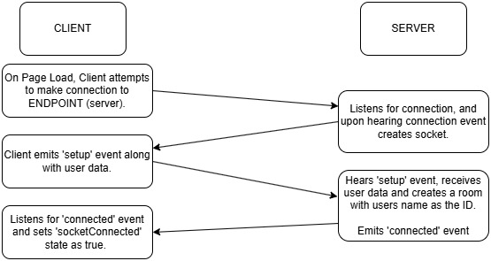

# CHAT APP

Please visit this Link, Its the App! 

https://troupe-nu.vercel.app/


## INTRODUCTION
This project is a real-time Chatting App which was built using the MERN Stack. The FrontEnd UI that the user communicates with is built using React, a Javascript Framework. All Data is stored in a MongoDB database, which is a NoSQL Database. ExpressJS framework is used to facilitate the building of REST APIs, which allow from the communication between our FrontEnd (Client) and BackEnd (Database). The Application is powered using Node.js Rutime and Node Package Manager is used to get the required libraries to build an Application powered by NodeJS.

## REQUIRED LIBRARIES
1. express : 
2. dotenv : 
3. mongoose : 
4. react-router-dom : 
5. jsonwebtoken : 
6. axios : 
7. socket.io : 
8. bcrypt : 
9. mongodb : 
10. cors : 

## PROJECT STRUCTURE AND SUMMARY
The project is divided into two parts, the FrontEnd and the BackEnd. The application is customised using TailwindCSS and React in the FrontEnd. Libraries such as Express and Mongoose enable the communication of our FrontEnd with the MongoDB database which has all user, message and chat data. 

## BACKEND 
The BackEnd of the project consists of 4 folders, which ensure that the user can interact with the database and perform CRUD (Create, Read, Update and Delete) oeprations with the Database.
- config : consists of files to configure mongoDB database connection and JWT token generation.
- Middleware : consists of Middleware to ensure that users can only access API routes to perform Controller functions only if they're authorised.
- Models : consists of the mongoDB structure of the data.
- Routes : this folder consists of the declaration of the API calls we make to perform interactions with the database using controllers
- Controllers : This consists of the functions that we perform as per the API calls of the user.
server.js

### STRUCTURE

```
├── backend
│   ├── config
│   │   ├── db.js
│   │   ├── generateToken.js
│   ├── Middleware
│   │   ├── authMiddleware.js
│   ├── Models
│   │   ├── ChatModel.js
│   │   ├── MessageModel.js
│   │   ├── UserModel.js
│   ├── Routes
│   │   ├── ChatRoute.js
│   │   ├── MessageRoute.js
│   │   ├── UserRoute.js
│   ├── Controllers
│   │   ├── ChatController.js
│   │   ├── MessageController.js
│   │   ├── UserController.js
│   ├── server.js

```
### CONFIGURATION FILES (config)

There are two files for configure, db.js to setup the database connection and generateToken.js which is called upon later within our Controller for when a user signs in.

#### 1) DATABASE CONFIGURATION FILE (db.js)
This file consists of the relevant code, to connect our application to the mongoDB database.

Mongoose is the ODM(Object Data Modelling) Library which enables us to interact with MongoDB database. Our Environment variable declared in .dotenv file are also loaded into process.env here
```
const mongoose = require('mongoose');
require('dotenv').config()
```

strictQuery ensures only properties(fields) decalred in schemas can be manipulated and are allowed in queries.
The function connecttodatabase uses the connect function using the MONGODB_URI, which is the connection string environment variable.

```
mongoose.set("strictQuery", true, "NewUrlParser", true);

const connecttodatabase = async () => {
    try{
        await mongoose.connect(process.env.MONGODB_URI, {});
        console.log("Successfully connected to MongoDB database")
    } catch (err) {
        console.error(err.message)
        console.log(process.env.MONGODB_URI)
        process.exit(1)
    }
    
}

module.exports = connecttodatabase;
```

#### 2) GENERATING JWT TOKEN (generateToken.js)
This contains the code which generates a token upon user sign on. This token is cross checked whenever an action takes place for authentication purposes.
jsonwebtoken library is imported, and it contains the functions to generate a unique token for a user. The user's id (username/email) is taken in the sign method is used with the arguements
- { id } → The payload (data stored inside the token). This includes the user’s ID.
- process.env.JWT_SECRET → The secret key used to sign the token. It should be stored securely in the .env file to prevent exposure.
- { expiresIn: "30d" } → The token will expire in 30 days, meaning the user will need to log in again after that time.

```
const jsonwebtoken = require('jsonwebtoken');
require('dotenv').config()

const generateToken = (id) => {
  return jsonwebtoken.sign({id},process.env.JWT_SECRET, {
    expiresIn: "30d",
  })
}

module.exports = generateToken
```

### MODELS 

These consists of files where we declare the structure of frequently used data structure i.e. Users, Messages and Chats.
(Only users is shown below as Users has special function which use bcrypt, Messages and Chats have their Schema declared as normal)

#### 1) userModel.js

In this File, moongoose is used to declare the Schema of the User. Bcrypt is used to perform two things
1. Ensure Passwords are comapred before user signs in.
2. Ensure that befire a usermodel is saved, (when a new user is created, or user details are changed)

First mongoose and bcryot libraries are declared so that they can be used
```
//import mongoose from 'mongoose';
const mongoose = require('mongoose');
const bcrypt = require('bcrypt');
```

Mongoose Library Object's constructor method Schema is used to build an instance (object) of user Model.
```
const usermodel = mongoose.Schema({
    username: {type:String, required:true},
    email: {type:String, required:true, unique:true},
    password: {type:String, required:true},
}, {
    timestamps:true
})
```

bycrypt library's method, compare is used to compare the password that the user entered and the hashed password that is stored in our database.
```
usermodel.methods.matchPassword = async function (passwordEntered) {
    return await bycrypt.compare(passwordEntered, this.password)
}
```

Below is a pre-save middleware function that runs before a user is saved to the database. This runs before a new user is added (or) if a user's details are updated.
First we check if the current instance/ object has been modified, if not next() is run which skips the rest of the code.
If it has been modified, the password is hashed.
genSalt(10) describes complexity of hashing, the salt is then used to hash password, and then the hashed password is saved in the Database.
```
usermodel.pre( "save", async function (next) {

    if (!this.isModified){
        next() //if this instance of this object is not modified next skips the enxt few lines within this pre save function
    }

    const salt = await bcrypt.genSalt(10)
    this.password = await bcrypt.hash(this.password, salt)
})
```
A model for the User is then generated based on the schema we previously declared. A scheme (usermodel here), needs to be converted to a Model so that we can interact with the MongoDB collection the data is in. Model is then exported so then it can be used in other parts of the application.
```
const User = mongoose.model("User", usermodel);

module.exports = User;
```

### MIDDLEWARE
Middleware consists of a single file, which is used to ensure that only authorised users can perform chats and other operations and 'protects the API routes which are the gateway to perform functions on our MongoDB database'.

#### AUTHENTICATION MIDDLEWARE (authMiddleware.js)

1) Firstly we import the required modules
```
const jwt = require('jsonwebtoken');
const User = require('../Models/UserModel')
const asyncHandler = require('express-async-handler');
require('dotenv').config();
```

2) We create a function called protect, which is called upon to enable authorisation of users


3) Within the function, we first check if the request that we received, has an authorization header and if the authorization header is a Bearer token
   Responses containing Authorization Headers are of the format:
   Authorization : Bearer <Token>
   Therefore we check that the Authorization Header starts with Bearer, to ensure we are only accepting bearer tokens.
   If Bearer Token exists we split the Authorization Header token and extract the token

4) jwt library's verify is then used to decode the token, which points to a user Id. (A dictionary is returned with Id in it into the decoded constant)

5) We then use mongoose method 'findByID' on the User model to find the relevant user details via the Id we just decoded, we get all details except the password and add it to the request.
```
const protect = asyncHandler( async (request,response, next) => {
    let token;

    if (request.headers.authorization && request.headers.authorization.startsWith("Bearer")){
        try{
            token = request.headers.authorization.split("")[1];
            const decoded = jwt.verify(token, process.env.JWT_SECRET)
            req.user = await User.findById(decoded.id).select("-password")
            next();
            
        } catch(err) {
            response.status(401);
            throw new Error("wrong token")
        }

    }
        if (!token){
        response.status(401);
        throw new Error("No Authorization Token there, hence authorization failed")
    }
});
```

### ROUTES

To perform the relevant function to influence the backend, we need to define an API route that can be called upon, and based on the request type, headers and body, the required function will be performed.

1) For the users we would need to be able to
- add users i.e., signup
- login users and authorise
- and get all users, this is relevant if we want to search for a particular user to start a new chat with

2) For the chats itself, we need to be able to
- get a chat, so that we can load it in
- start a new chat with a user, so add chat
   We also need the below features for group chats
- Creating a new group
- Adding member to the group
- Removing members from the group
- And Renaming the Group

3) For the messages itself, we need to be able to
- Load the relevant messages of the chat
- Add a message to the chat

We would need to use express libarary's Router method to initialise router, and defining the relevant routes.
The protect middleware is also used, so only authorised users can access the route and make the relevant calls

### CONTROLLERS


## FRONTEND

### STRUCTURE

```
├── frontend
│   ├── src
│   │   ├── components
│   │   │   ├── miscallaneous
│   │   │   │   ├── ChatModal.jsx
│   │   │   │   ├── GCModal.jsx
│   │   │   │   ├── ProfileModal.jsx
│   │   │   │   ├── UpdateGroupChatModal.jsx
│   │   │   ├── userAvatar
│   │   │   │   ├── UserBadgeItem.js
│   │   │   │   ├── UserListItem.js
│   │   │   ├── MyChats.js
│   │   │   ├── ScrollableChat.js
│   │   │   ├── SingleChat.js
│   │   ├── config
│   │   │   ├── ChatLogics.js
│   │   ├── Context
│   │   │   ├── ChatProvider.js
│   │   ├── Pages
│   │   │   ├── ChatPage.js
│   │   │   ├── HomePage.js
│   │   │   ├── LogonPage.js
│   │   │   ├── RegisterPage.js
│   │   ├── App.css

```
### CONFIGURATION FILE (ChatLogics.js)

### CONTEXT FILE (ChatProvider.js)

### PAGES AND USER INTERFACE

#### 1) HOME PAGE

#### 2) LOGON PAGE

#### 3) REGISTRATION PAGE

#### 4) CHAT PAGE

## WEBSOCKET IMPLEMENTATION - CONNECTION THE CLIENT AND SERVER IN REAL TIME

WebSockets are used to enable real time updates within the app. This is done by enabling a persistent connection between the client and the server.

All the implementation has been done in 2 files, the server files (server.js) and the Component for Chats (SingleChat.js). There are 3 instances where WebSockets have been implemented. They are explained in flowcharts below.

### 1) Establishing Socket Connection

<p align="center">
  
</p>

### 2) Establishing Rooms to enable real time chatting

Users who have a socket connection, when needing to chat to each other are put in the same room, which the room id as the id of the chat they are in.

<p align="center">
  
</p>


